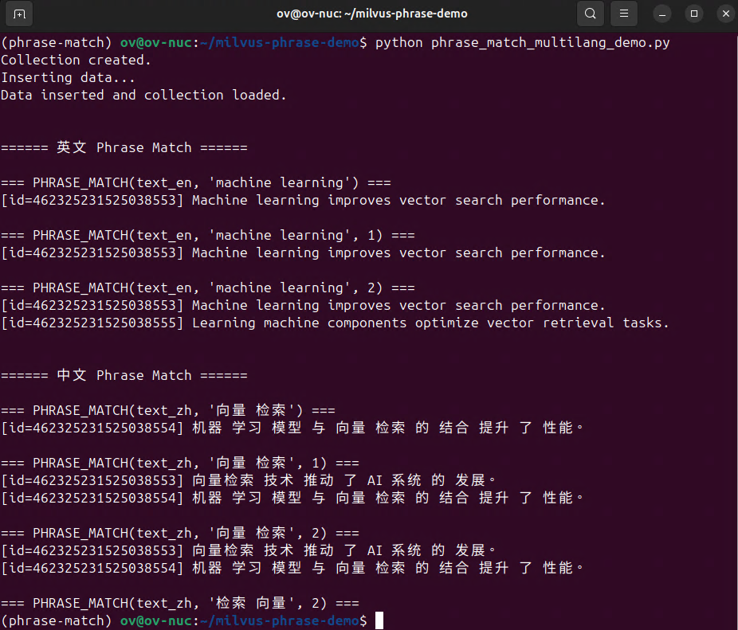

# 🔍 Milvus 2.6 Phrase Match 多语言演示（中文 + 英文）

本仓库提供一个可直接运行的 **Milvus 2.6 Phrase Match（短语匹配）多语言 Demo**，展示中英文 analyzer 的差异、短语匹配（Phrase Match）中位置与 slop 参数如何影响匹配行为、以及如何在实际检索场景中将短语匹配作为硬约束与向量检索结合来实现更精确且可控的 RAG / 企业知识库检索流程。示例内容包括：

- 中文 & 英文 analyzer 对比
- Phrase Match 的 slop 机制
- 中文倒排分词与短语匹配演示
- Phrase Match + 向量检索的混合搜索示例

适用于：

* RAG（Retrieval-Augmented Generation）
* 企业知识库
* 中英文混合搜索
* 短语精确匹配（法律、技术文档、API 索引、专利检索）

---

# ✨ Demo 功能亮点

## 🔹 多语言 Analyzer 对比

Milvus 内置的 analyzer 会直接影响 Phrase Match 结果：

* 英文 → english analyzer
* 中文 → chinese (Jieba) analyzer

👉 使用 **standard** analyzer 会导致中文无法分词，Phrase Match 无法工作。

---

## 🔹 Phrase Match slop 机制（连续 → 插词 → 倒序匹配）

Phrase Match 支持 slop：

| slop | 行为        | 示例             |
| ---- | --------- | -------------- |
| 0    | 必须连续短语    | “向量 检索”        |
| 1    | 允许插入 1 个词 | “向量 **深度** 检索” |
| 2    | 支持倒序/更大距离 | “检索 向量”        |

---

## 🔹 混合搜索：Phrase Match + 向量检索

生产级 RAG/搜索的黄金组合：

```
1. Phrase Match 做硬约束（必须包含某短语）
2. Vector Search 做语义排序（最相关的排前）
```

---

# 📁 项目结构

```
.
├── phrase_match_multilang_demo.py    # 主 Demo 脚本
├── docker-compose.yml                # Milvus 2.6 Standalone 环境
├── README.md                         # 本文件
└── requirements.txt                  # Python 依赖
```

---

# 🚀 1. 环境准备

## ① 安装 Docker（Ubuntu）

参考 Milvus 官方文档或执行：

```bash
sudo apt update
sudo apt install docker.io docker-compose -y
sudo usermod -aG docker $USER
```

⚠️ **添加 docker 用户组后记得重登系统**

---

## ② 拉起 Milvus 2.6 Standalone

```bash
docker compose up -d
```

成功后，访问：

```
http://localhost:19530
```

Milvus 即处于可用状态。

---

# 🐍 2. 创建 Python 环境

```bash
python3 -m venv venv
source venv/bin/activate
pip install -r requirements.txt
```

---

# ▶️ 3. 运行 Demo

```bash
python phrase_match_multilang_demo.py
```

你会看到输出类似：

<div align="center">
  
  <br>
  <em>phrase_match_multilang_demo.py执行结果</em>
</div>

---

# 📊 4. 中文 vs 英文 Analyzer 分词对比图

```
┌───────────────────────────────┬──────────────────────────────┐
│            英文句子            │            中文句子           │
├───────────────────────────────┼──────────────────────────────┤
│ "Machine learning improves    │ "向量检索 技术 推动 了 AI 系统 的 发展" │
│  vector search performance."  │                                  │
├───────────────────────────────┼──────────────────────────────┤
│ Analyzer: english             │ Analyzer: standard (错误示例)    │
│ Tokens:                       │ Tokens:                          │
│  machine                      │  （整句当作 1 个 token）         │
│  learning                     │  → Phrase Match 无法工作          │
│  vector                       │                                  │
├───────────────────────────────┼──────────────────────────────┤
│ Analyzer: english（正确）       │ Analyzer: chinese（Jieba）        │
│ Tokens:                       │ Tokens:                          │
│  machine                      │  向量                            │
│  learning                     │  检索                            │
│  vector                       │  技术                            │
├───────────────────────────────┼──────────────────────────────┤
│ ✔ Phrase Match 生效             │ ✔ Phrase Match 生效               │
└───────────────────────────────┴──────────────────────────────┘
```

---

# 🔬 5. Phrase Match 工作流程图（倒排 + pos + slop）

```
文本 → Analyzer 分词 → 倒排索引(token→docID→position[])
                                      │
                                      ▼
       Phrase Query 解析："向量 检索" → ["向量", "检索"]
                                      │
                                      ▼
         倒排表求交集：必须包含所有 token 的文档
                                      │
                                      ▼
         position 匹配（slop）：
            pos2 - pos1 - 1 ≤ slop ?
            或 abs(pos2 - pos1) ≤ slop（倒序）
                                      │
                                      ▼
               slop=0：必须连续
               slop=1：允许插 1 个词
               slop=2：支持倒序 / 更大距离
                                      │
                                      ▼
                    输出最终命中文档
```

---

# 🧪 6. Demo 对比结果（中文）

## ✔ slop=0（必须连续短语）

匹配：

```
向量检索 技术 推动 了 ...
```

---

## ✔ slop=1（允许插词）

匹配：

```
向量检索 技术 ...
机器 学习 模型 与 向量 检索 ...
```

---

## ✔ slop=2（倒序 / 多词间隔）

匹配：

```
在 实际 应用 中，向量 深度 检索 方法 ...
```

---

# 🧠 7. 为什么 Phrase Match 在生产中很重要？

适用于：

* RAG（硬约束：必须含某短语）
* 法律条款搜索（顺序和距离非常关键）
* 技术文档/专利检索（名词短语固定）
* 日志分析（match 特定短语）
* 多语言内容平台（中英文自动分词）

---

# 🔥 8. Phrase Match + Vector Search = 最佳实践

```python
client.search(
    anns_field="embeddings",
    data=[query_vec],
    filter="PHRASE_MATCH(text_zh, '向量 检索', 1)",
    limit=5
)
```

* Phrase Match → 过滤
* 向量检索 → 语义排序

这是工业级搜索/RAG 的主流方案。

---

# ❤️ 9. 联系与贡献

欢迎提交 Issue / PR
也欢迎加入 Milvus 社区交流与贡献！


