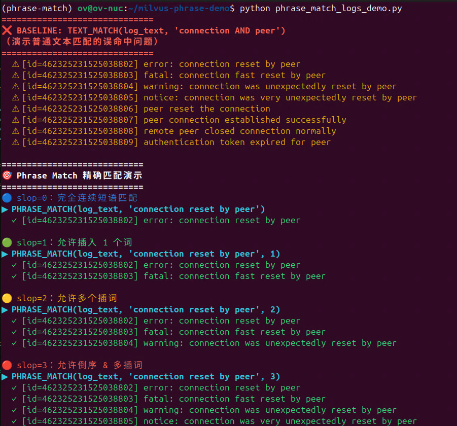
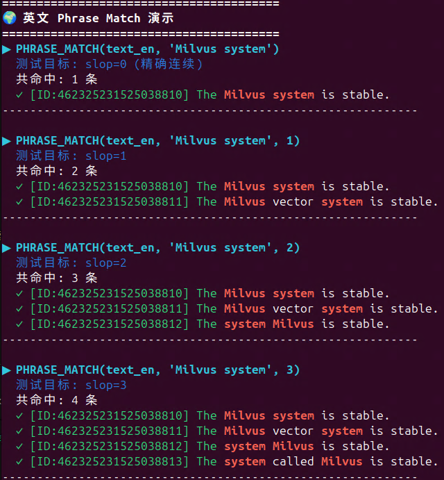
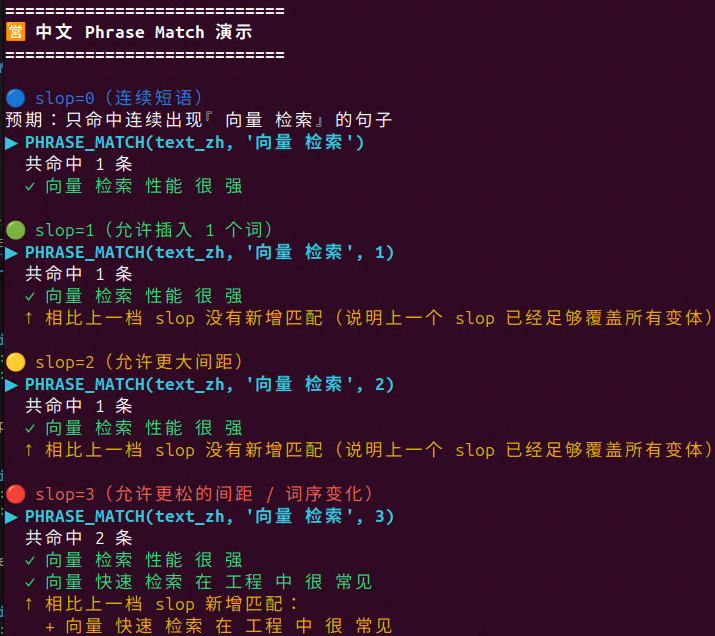

# 🚀 **Milvus Phrase Match Demos（适配 Milvus 2.6）**

### —— *高级短语匹配 × 多语言分词 × 日志检索 × RAG 强化*

---

# 📚 **什么是 Phrase Match？**

> **Phrase Match = 倒排索引 + 多语言分词器 + 词位置（position）+ 距离（slop）**
> 用于：
>
> * 搜索短语是否真实出现
> * 词序是否相邻
> * 可否插词
> * 可否倒序

它是传统 BM25、向量搜索无法表达的 **硬性条件约束**。

---

# 🎯 **为什么你需要 Phrase Match？**

**真实生产场景：**

| 场景       | 需求                                      |
| -------- | --------------------------------------- |
| 日志排查     | 错误短语必须连续，如 `"connection reset by peer"` |
| 文档检索     | 技术术语必须连续，如 `"机器 学习 模型"`                 |
| API 搜索   | `"Milvus system"` 必须连续出现                |
| 法律/合同/规则 | 关键术语必须逐词匹配                              |
| RAG 检索增强 | 硬过滤（短语必须出现） + 语义过滤（向量）                  |

---

# 🧪 Demo 1：日志短语匹配（英文）

+ ✔ slop=0：必须紧邻
+ ✔ slop=1：允许插一个词
+ ✔ slop=2：允许插多个词
+ ✔ slop=3：允许倒序

运行：

```
python phrase_match_logs_demo.py
```
<div align="center">
  
  <br/><em>图 1 </em>
</div>

---

# 🌍 Demo 2：中英混合短语匹配（multilang）

本 Demo 展示一个核心事实：

> **⚠ 中文 slop 行为与英文不同（官方 [issue #45807](https://github.com/milvus-io/milvus/issues/45807) 已解释）**
> 因为中文词的 `positionLength` 可能大于 1
> 导致 slop 实际需要值更大、更稀疏（1、3、5、7…）

运行：
```
python phrase_match_multilang_demo.py
```

<div align="center">
  
  
</div>


---

# 🐳 **使用 Docker 启动 Milvus（推荐方式）**

本项目已准备好 `docker-compose.yml`，可一键启动 Milvus Standalone 环境。

Milvus 2.6+ 默认使用 **RESTful API + Token（root:Milvus）**，本项目中的 Demo 连接地址：

```
URI:   http://localhost:19530
TOKEN: root:Milvus
```

## ▶️ 1. 克隆本项目

```
git clone https://github.com/openvino-book/Milvus-Phrase-Match-Demo
cd milvus-phrase-match-demos
```

## ▶️ 2. 启动 Milvus

运行：

```bash
docker compose up -d
```

首次启动约 5~10 秒。

你可以通过以下命令查看容器状态：

```bash
docker compose ps
```

如果看到：

```
milvus-standalone   running
etcd                running
minio               running
```

说明 Milvus 已就绪。


---

## ▶️ 3. 关闭 Milvus（可选）

```bash
docker compose down
```

删除所有数据（如果想干净重置）：

```bash
docker compose down -v
```

---

# 🎯 **Milvus 已启动后，即可运行本项目 Demo**


```
# Install dependencies
pip install -r requirements.txt

# Run Demo 1: Log phrase matching
python phrase_match_logs_demo.py

# Run Demo 2: Multi-language (English + Chinese) phrase matching
python phrase_match_multilang_demo.py

```

---

# ❤️ 贡献与反馈

欢迎：

* 提交 issue
* PR 更多示例
* 讨论中文 slop 的最佳实践
* 讨论Phrase Match的产业最佳实践

